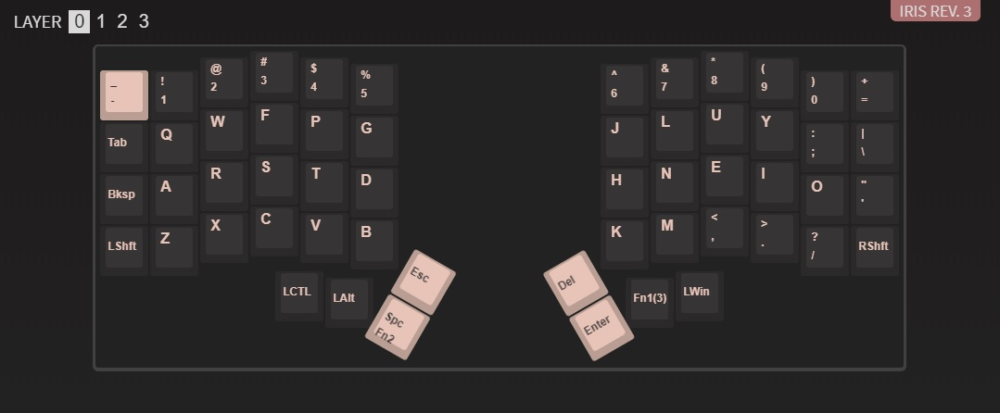
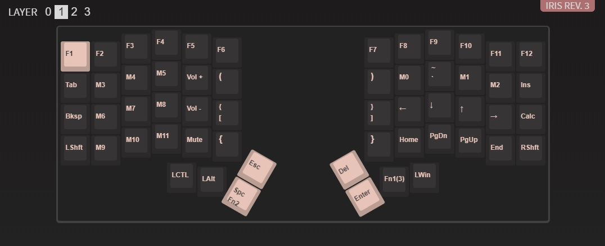
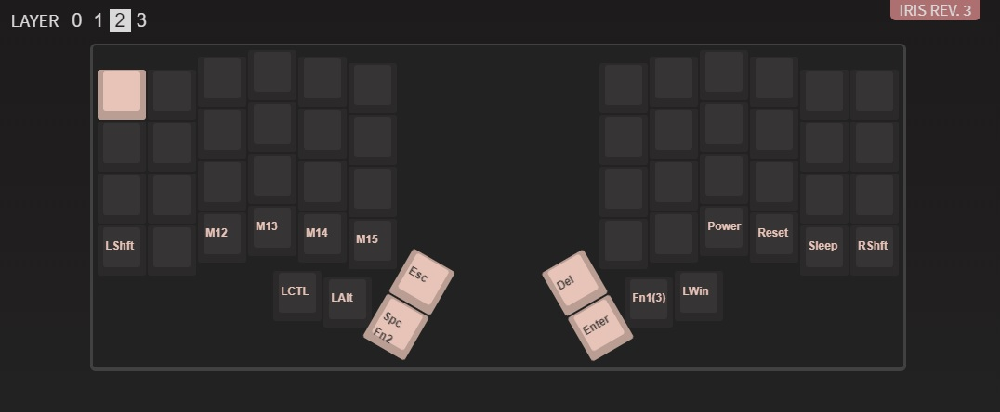

# iris-colemak

## Colemak keymappings for [Iris Keyboard](https://keeb.io)

 

 

 

## Setup

<b>!!IMPORTANT!!</b> You need to save your default config before any operations because they cannot be undone!
 

1. `git clone https://github.com/iris_colemak && cd iris_colemak`

2. Download [VIA](https://github.com/the-via/releases/releases/tag/v1.3.1)

3. Save your current mappings

4. Open your default mappings in any editor and take the value of `"vendorProductId"`

5. Open `./iris_colemak.json` and replace `ID_HERE` by ID of your Iris

6. Load `./iris_colemak.json` to the VIA configurator
